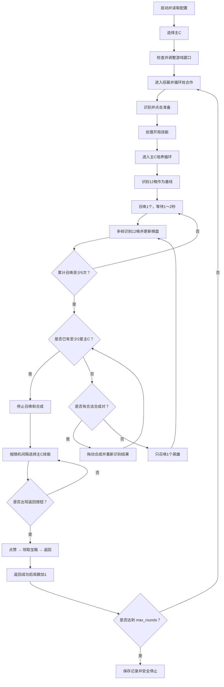

# 自动化执行流程

本文档记录已经确认的端到端自动化流程，是后续状态机设计和代码实现的流程基准。具体游戏事实见 [游戏规则知识库](game-rules.md)，技术结构见 [架构设计](architecture.md)。

## 启动配置

脚本启动时从配置文件读取：

- `max_rounds`：本次最多完成的合作局数；命令行 `wlxq-bot run --max-rounds N`（简写 `-n`）可覆盖本次运行。
- `max_steps_per_round`：单局调度循环的最终安全保险；返回验证成功、局数增加后重置，不限制多局累计步数。
- `minimum_summon_count_before_skills`：允许进入局内技能选择前必须完成的最低召唤次数，当前为 5。
- `initial_board_capacity`：合作模式开局开放格数，当前已确认为 7。
- `target_star_level`：停止召唤和合成的主 C 最低星级，当前为 2。
- `summon_recognition_delay_min/max`：每次召唤后等待英雄落位再识别的区间，当前方案为 1～2 秒。
- `board_recognition_frames`：每次培养决策连续识别棋盘的帧数，默认 10。
- `home_return_confirm_frames`：等待开局期间连续识别到首页标记的确认帧数，达到即判定本局被取消/被踢回首页，默认 2。
- `match_start_timeout_seconds`：点击准备后等待对局界面的超时（秒），超时按本局未开始处理、重新进入招募，默认 120。
- `leave_team_after_seconds`：组队大厅等待房主开始超过该秒数（识别到【退队】按钮）即主动退队重新抢合作，默认 20。
- `window_foreground_wait_seconds`：窗口非前台/最小化时的最长挂起等待（秒），期间任务不发送任何输入（点击会落到当前前台窗口），对局自动进行、切回后从当前进度继续；超时才保守停止，默认 300。主循环和抢合作阶段共用此策略。
- `refocus_when_idle` / `refocus_idle_seconds`：挂起期间检测系统鼠标/键盘空闲（GetLastInputInfo，全系统），无输入超过 `refocus_idle_seconds`（默认 20 秒）即认为用户没用电脑，自动把游戏窗口切回前台继续任务；用户正在操作时不抢焦点。激活失败按 5 秒节流重试。主循环和抢合作阶段共用此策略。
- `coop_difficulties`：首次招募时需要勾选的难度范围，命令行可以覆盖。
- 主 C 档案策略字段（`main_c_profiles.<主C>`，当前仅强袭启用）：`avoid_main_c_merge`（合成尽量不合并主C，保数量）、`topup_after_skill_selections` / `topup_hero_count`（局内选满 N 次技能后回培养把主C数量补到目标以上）。
- `skip_difficulty_selection`：游戏本次会话已手动选过难度时，首局招募只跳过勾选难度等级，弹窗仍开/关一次刷新邀请；命令行 `--skip-difficulty-selection` 可覆盖。
- 所选主 C 的技能卡英雄图标模板 `skill_icon_templates`。
- 队友英雄技能卡图标 `teammate_skill_icon_templates`（本局阵容其余三名英雄）：主C图标未命中但识别到任一队友图标时，立即随机选卡。
- 识别阈值、等待时间和安全重试参数。

用户启动时只需要选择本次主 C，当前优先支持强袭和猴子。随后脚本检查游戏窗口；若客户区尺寸与本机配置（`configs/local.yaml`）不一致，`run.auto_adjust_window`（默认开启）会自动把窗口调整到目标尺寸（等价 `wlxq-bot adjust-window`），调整后仍不一致才报错停止；关闭该开关则退回旧行为——停止并提示手动执行 `wlxq-bot adjust-window`。未配置 `local.yaml` 时无目标尺寸，不做调整，模板包按显示器分辨率选择。

## 调度循环的截图时效

`safety.frame_ttl_ms`（默认 3000）约束「截图 → 识别 → 决策 → 执行」全程：决策所依据的画面超过时效后不再执行输入。识别耗时随机器状态波动（高负载、省电模式、多模板匹配——实机 2026-08-17 曾因慢速状态下难度弹窗帧每轮约 6 秒，动作全部被时效拒绝并耗尽失败预算导致任务停止），因此超龄不是动作失败：丢弃本轮决策、重新截图重试（难度弹窗等静态界面晚几秒重试仍有效），不消耗安全失败预算，WARNING 日志输出截图/识别的分段耗时；连续多轮（当前 10 轮）超龄才保守停止。

合作模式当前已确认 `initial_board_capacity = 7`、`minimum_summon_count_before_skills = 5`；每累计召唤 5 次会自动开放 1 个新格，因此第 5 次召唤后开放格数变为 8，同时才允许进入局内技能选择。程序不需要通过视觉复核开放格数。

## 总体流程



## 进入招募小流程

进入招募不单独占用顶层状态；它是 `FIND_COOP` 内部由任务代码实现的固定子状态机。每轮只生成一个 `Action`，经 `Action Executor -> Safety Guard -> Input Controller` 执行后再推进内部步骤。配置不声明流程顺序；各 hotspot 统一使用 9:16 游戏客户区比例坐标并保存在 `configs/tasks.yaml`。

```mermaid
flowchart TD
    A{"是否首次进入？"}
    A -- "是" --> A2{"是否正向识别为游戏首页？"}
    A2 -- "否" --> X["报错并保守停止，不发送输入"]
    A2 -- "是" --> B["点击首页聊天"]
    B --> C["点击招募"]
    C --> D["打开难度弹窗"]
    D -- "默认" --> D2["按从小到大选择配置难度"]
    D -- "skip_difficulty_selection" --> E
    D2 --> E["取消难度弹窗"]
    A -- "否，结算返回后" --> F["点击合作页面聊天"]
    F --> F2["打开难度弹窗"]
    F2 --> F3["关闭难度弹窗，刷新合作邀请"]
    E --> G["进入抢合作循环"]
    F3 --> G
```



任务 hotspot、ROI 和棋盘坐标都保存在可提交的 `configs/tasks.yaml`，作为相同 9:16 游戏布局下的通用定位参数。`configs/local.yaml` 不保存任务坐标，只保存本机窗口规格和模板包覆盖。

首次进入必须先通过 `home_page_marker` 模板正向确认当前画面是游戏首页。模板缺失或识别阈值尚未标定时，启动检查直接报错；模板存在但首帧未命中时，同样报错并停止，不得点击首页聊天。确认首页后，才按“首页聊天 → 招募 → 打开难度弹窗 → 确认弹窗打开 → 选择难度”的顺序继续。游戏本次会话已手动选过难度时，可开启 `run.skip_difficulty_selection`（配置项或 `wlxq-bot run --skip-difficulty-selection`）：首局只跳过“勾选难度等级”这一步，难度弹窗仍然打开并关闭一次——打开再关闭弹窗才会刷新出最新的合作邀请；启动检查也不再要求难度模板存在。结算返回后的下一局仍从合作页面聊天进入，不重复执行首页检查和难度勾选；无论是否跳过首局难度选择，都必须打开再关闭一次难度弹窗，触发新的合作邀请刷新后才能进入抢合作循环。

招募入口内的首页聊天、招募、打开难度弹窗，以及下一局刷新邀请步骤，按已确认策略使用 hotspot 点击成功即推进内部步骤，不增加页面切换的动作后识别门禁。**难度弹窗的打开确认与关闭确认是例外**（2026-08-21 实机定案）：弹窗打开快慢不定、关闭动画有延迟，且弹窗没关住会挡住 `join_coop` 导致抢合作无效连点（连点还会落在难度行上误改勾选），因此开关都必须识别确认后才推进。弹窗开关的判定依据是【合作模式】标题图（`he_zuo_mo_shi`，2026-08-21 更换为重新采集的弹窗固定标题图）：该图可见 = 弹窗打开，不可见 = 弹窗关闭；难度候选（`cai_hong_N`）只在勾选步骤识别，打开/关闭确认步骤只匹配标题图（轻量识别模式，2026-08-17 实机问题：16 个候选匹配会把慢速机器的单帧识别拖到超过截图时效）。

关闭动作的点击点随游戏更新变更过：2026-08-15 版本点击弹窗左下「取消」按钮；**2026-08-17 游戏更新后「取消」按钮已不存在**（像素级复核调试截图：原坐标落在难度行左侧空白，且 `he_zuo_mo_shi` 实际匹配的是面板列表行内的「合作模式-彩虹N」标签，位置随列表滚动移动）。面板打开时左侧栏「招募」按钮仍在原标定位（同 `open_recruit` 坐标，已在面板打开状态的调试截图上复核），因此关闭动作改为**点击「招募」按钮收起面板**（实机确认 2026-08-17：用户手动验证 + 自动流程完整跑通）。注意旧模板在 2026-08-21 前实际匹配的是面板列表行内的「合作模式-彩虹N」标签，只存在于彩虹难度区且随列表滚动移动；2026-08-19 起面板每次打开都定位在普通区（第1~12层），该标签不再命中，关闭确认只能靠「尚未见过标识」的连续空帧超时，无法区分「已收起」与「停在普通区」——实机已出现带着未关闭弹窗进入抢合作、连点落在面板内的问题。**2026-08-21 已更换模板**为重新采集的弹窗顶部固定标题图（`buttons/coop_difficulty/he_zuo_mo_shi.png`），不随列表滚动，普通区/彩虹区均应命中，普通区盲区随之消除（待实机验证）；旧模板文件已删除。

打开确认步骤的逻辑（点击打开难度弹窗按钮后）：先固定等待 `difficulty_open_settle_seconds`（默认 0.5 秒，等点击生效即可，打开慢由失败预算兜底），再每 `difficulty_poll_interval_seconds`（默认 0.25 秒）识别一次标题图——**连续 `difficulty_open_confirm_hits` 次（默认 2，即连续 0.5 秒可见；2026-08-25 实机从 4 调低）识别到**才算弹窗打开，弹出动画帧凑不够连续命中；**连续 `difficulty_open_fail_misses` 次（默认 16，即 4 秒不出现）识别不到**说明本次点击未生效，重点打开按钮（最多 `difficulty_open_max_reclicks` 次，默认 3），重试用尽仍打不开则保守停止——绝不带着「没打开」的假设进入勾选或关闭（打开按钮位置落在面板列表区内，弹窗开着时重点会误点难度行）。

关闭步骤的逻辑（勾选完成或刷新路径确认打开后）：标题图可见 = 没关住，点击「招募」按钮收起面板；每 `difficulty_poll_interval_seconds` 识别一次，**连续 `difficulty_close_confirm_frames` 次（默认 2，即连续 0.5 秒不可见；2026-08-25 实机从 4 调低）识别不到**才确认关闭——单帧漏检不再致命，打开确认已在前把关、无需「尚未见过打开」的空帧超时分支。收起动画期间标题图可见只会触发再次点击（实机确认：面板已收起时再点招募按钮无反应，重复点击无副作用）。标识持续可见就再次点击关闭，最多 `difficulty_close_max_attempts` 次（默认 5），耗尽仍可见则保守停止，绝不带着未关闭的弹窗进入抢合作。抢合作成功仍以准备按钮出现为准。

难度选择子流程：

```text
读取 coop_difficulties（命令行覆盖优先；编号一律指彩虹难度）
→ 解析为从小到大的待选集合，例如 1-10 → 1,2,…,10（面板打开停在列表
   顶部、编号小的先出现，单程向下滚动点完，无需回滚）
→ 面板每次打开都定位在普通难度区（第1~12层，彩虹行不可见）：
   识别为空时从下往上拉，向更大难度滚动直到彩虹行出现
→ 在 coop_difficulty_list ROI 中逐模板独立匹配 cai_hong_1~18：每个编号
   一张实机裁剪的文字模板，各匹配各的（不做序列推断）；同一行被多个
   相近模板命中时按中心点距离合并、保留置信度最高者
→ 目标难度可见：开环点击文字模板中心，点击发送即计为已选并推进下一个
   目标——不识别勾选框状态（2026-08-19 实机定案：合作/宠物等邀请弹窗
   只遮挡勾选框、从不遮挡行文字，点击几何上永远落在行上；代价是已选过
   的会话必须用 --skip-difficulty-selection 跳过，再次点击会取消勾选）
→ 目标难度不可见：根据可见编号决定方向，使用比例拖动点滚动列表
→ 滚动后读取下一帧并重新识别；结果未变化也只计入有限滚动预算
→ 全部选完后取消难度弹窗
```

难度文字模板不受右侧复选框选中状态影响，且不包含复选框——开环设计不识别勾选框状态（`gou_xuan`/`gou_xuan_kong` 模板已实机采集，留档备查未使用）。一屏是 4 行还是 5 行不参与决策；程序只消费当前实际识别到的候选。拖动起点和终点来自 `difficulty_scroll_start` / `difficulty_scroll_end` 比例 hotspot，二者的比例差决定拖动距离，实际像素距离由当前客户区尺寸实时换算；向更大难度滚动（进入/深入彩虹区）从偏下的终点拖向偏上的起点（从下往上拉），向较小难度滚动方向相反。单个目标难度的滚动次数由 `difficulty_max_scrolls` 限制，预算需覆盖从普通区滚入彩虹区的行程；达到上限仍未识别或缺少滚动 hotspot 时，记录并跳过当前目标——从没见过彩虹行的跳过不重置预算，后续目标直接级联跳过，避免每个目标重复空滚一遍。正式流程和 `exec select-difficulty` 都会输出选中与跳过汇总。

实机验证时可手动打开难度弹窗，再执行 `wlxq-bot exec select-difficulty --coop-difficulties 1-10`。该命令只运行上述选择步骤，完成后保持弹窗打开，不进入后续招募流程。

## 抢合作与准备

抢合作采用双线程重叠执行，避免“识别准备按钮期间停止点击”造成的死区——识别耗时内不点击就可能错过新邀请，而抢合作拼速度。任务在 `JOIN_COOP` 步骤只发出 `kind="grab_coop"` 信号动作，由 `Runner` 启动 `CoopGrabCoordinator` 执行：

```text
进入招募列表（JOIN_COOP 步骤）
→ Runner 启动两个线程：
   - 抢合作线程：经执行器以拟人间隔（find_coop_click_delay_min/max）连点
     join_coop hotspot，不做识别
   - 检查线程：按 find_coop_check_interval_seconds 周期截图并匹配准备按钮
→ 任一线程发现窗口失焦/最小化：暂停连点挂起等待切回（与主循环同策略：
   空闲自动切回、超过 window_foreground_wait_seconds 才保守停止），
   切回后自动恢复连点和识别
→ 检查线程识别到准备按钮：通知抢合作线程停止，两线程退出
→ 回到主循环，重新截图识别准备按钮（保证 frame_id 校验）
→ 点击准备按钮匹配中心
→ 准备按钮消失后等待界面稳定
→ 进入开局技能流程
```

抢合作线程只点击、检查线程只识别，二者不争用输入；点击准备始终在两线程退出后由主循环单线程执行，仍走正常 `Action Executor`。点 join_coop 的位置来自 `configs/tasks.yaml` 的通用 hotspot，不再识别“加入”按钮。准备按钮是“已经抢到合作”的唯一确认标志。整段抢合作受 `find_coop_max_duration_seconds` 限制，超时未抢到则保守停止。

连点执行失败分两类处理（2026-08-22 实机定案）：「窗口最小化或非前台」「窗口上下文已超时」是瞬态失败，不累计——失焦/最小化由检查线程的挂起逻辑等待切回（执行器逐击实时校验前台，失焦期间点击自动暂停），上下文超龄只是检查线程刷新周期偶发超过 `frame_ttl_ms`，等刷新即可；其余失败（句柄失效、客户区几何变化、输入异常）连续 3 次即判 `window_lost` 保守停止，并以 WARNING 记录最后失败原因。检查线程的前台有效截图同样进入退出帧缓冲，抢合作阶段丢失窗口瞬间的画面也能落盘排查。

“加载中”不作为独立业务状态：它只是点击准备后、对局界面尚未稳定的一段等待时间，仍属于 `ENTER_MATCH` 到 `SELECT_OPENING_SKILLS` 的迁移过程。

等待开局期间（`SELECT_OPENING_SKILLS`）每帧额外识别首页标记（实机确认 2026-08-15：发起者可踢出已加入玩家，被踢后对局不开始、回到游戏首页）：

```text
组队大厅识别到【退队】按钮（coop_leave_team），且点准备后已等待超过
   leave_team_after_seconds（默认 20 秒）房主仍未开始
→ 点击退队（以按钮消失验证），退出本队
→ 落点页面未实机确认：先识别首页标志——在首页则走「首页聊天 → 招募」入口，
  否则按合作页面走「合作页面聊天」入口；两条路径都不重复勾选难度
连续 home_return_confirm_frames 帧识别到首页标记
→ 判定本局被取消/被踢回首页（单帧命中可能是加载画面相似，不触发）
→ 清空对局内进度，回到 FIND_COOP 从首页重新走「首页聊天 → 招募 → 开/关难度弹窗 → 抢合作」
→ 重新进入不再勾选难度（本会话已选中，重复点击会取消勾选）
点准备后 match_start_timeout_seconds 秒内始终未见对局界面
→ 同样按本局未开始处理，重新进入招募
（若此时画面不是首页，首页确认步骤会报错并保守停止）
```

## 进入游戏后的技能检查

`SELECT_OPENING_SKILLS` 表示刚进入游戏、可能出现的开局技能选择。

开局技能是游戏免费赠送的：进入对局后技能选择页面**自动弹出**（不点「选择技能」按钮、不花金币），给出 3 张技能卡。该页面与对局中点击「选择技能」按钮（花金币）弹出的页面是同一个，都用【选技能】图（`buttons/xuan_ze_ji_neng.png`）标识。开局技能页面会**遮住召唤按钮**，必须选完、页面消失后才能召唤。

进入游戏后按「先选技能、再召唤」识别开局类型（二者作为界面标志在主循环每帧识别，`select_skill_button_visible` / `summon_button_visible`）：

- 【选技能】可见 → 处于技能选择页面（本局有开局技能），按下流程选卡。
- 【召唤】（`buttons/zhao_huan.png`）可见且无【选技能】→ 本局无开局技能，直接进入主 C 召唤阶段（`BUILD_MAIN_C`）。
- 二者都未识别到 → 对局界面尚未稳定，继续等待。

简化版技能识别复用主 C 的英雄图标（同一英雄的所有技能卡共用一张图标）：

```text
【选技能】可见（开局免费自动弹出）
→ 在技能 ROI 匹配主C技能图标（skill_icon_templates）
→ 图标在动会单帧漏检：连续 skill_recognition_frames 帧多帧重试
→ 命中主C图标：随机点其中一个（多个时随机点其一）
→ 主C未命中但识别到队友图标（teammate_skill_icon_templates，本局阵容
   其余三名英雄，实机采集 2026-08-15）：证明页面已稳定且本组无主C技能卡，
   页面已出现 skill_fallback_settle_frames（默认 1）帧后立即将技能候选 ROI
   横向三等分随机点击一列中心，不等满识别帧——页面刚弹出时图标可能先于
   卡片渲染出来，首帧即点会点空
→ 连续 skill_recognition_frames 帧未命中：将技能候选 ROI 横向三等分，随机点击一列中心
→ 技能候选 ROI 缺失或无效：保守停止；点击后通过下一帧验证页面关闭或候选变化
→ 每选一张后留在技能选择状态继续识别
→ 找不到【选技能】（页面关闭、【召唤】出现）且已选满 opening_skill_max_selections 次
   （实机确认开局技能最多 3 次，不会再多）→ 开局技能选完，直接进入英雄召唤阶段
→ 未选满时：连续 opening_exit_confirm_frames 帧确认页面不在
   （每次选完一张卡后页面会先关闭、下一组技能卡再弹出，间隙里召唤按钮会短暂露出，
   单帧「页面消失」不能判定选完，否则会漏选最后一组技能）
→ 连续确认页面不在 → 开局技能选完，进入英雄召唤阶段
```

天使英雄的开局技能页是特例（实机确认 2026-08-15）：页面不出现【选技能】图、也没有主C技能图标，只出现天使开局标识（`tian_shi_kai_ju`，仅在本状态识别）。命中标识即直接将技能候选 ROI 横向三等分随机点一张（tag `opening_angel_skill_fallback`），无需等待识别帧；动作后以该标识消失验证选完。

不需要为每个技能单独配模板或优先级，只要主C一张技能卡图标即可；图标命中位置即主C技能卡。连续多帧未命中才改「随便选一个」，避免动画漏检误判。

## 主 C 培养循环

使用格子分类模型后，先识别全部 12 格作为基线，然后始终逐次执行“召唤 1 次 → 等待 1～2 秒 → 多帧识别全部 12 格 → 更新棋盘”。棋盘初始开放 7 格，并在第 5 次召唤后自动扩为 8 格。

强制召唤阶段（技能解锁前 5 次）做了快速化（2026-08-16 实机确认：召唤点击本身很快，英雄登场约 2 秒才稳定）：该阶段**跳过多帧棋盘识别**（点击发送即计数，识别不作门禁），前 4 次按 `forced_summon_interval_seconds`（默认 0.5 秒）固定间隔连点，第 5 次保留正常的 1～2 秒稳定等待后再进入棋盘决策。召唤出的英雄：

- 类型随机为本局携带的 4 种英雄之一。
- 初始星级随机为 1 星或 2 星。
- 随机落在当前可用棋盘格中。

前 5 次是强制召唤阶段。只要点击动作成功发送就立即累计次数；等待后的识别用于更新棋盘和记录目标主 C，未确认变化或识别不稳定只记日志，不能阻止下一次强制召唤。累计召唤不足 5 次时不得进入局内技能选择。第一版目标策略不在强制阶段插入合成，以最少动作先完成技能解锁门禁；这是策略选择，不是游戏限制。第 5 次召唤发送并完成等待后检查：

培养阶段任意时刻识别到技能选择页（通常为两个 3 星合成 4 星时系统赠送的 3 选 1，实机确认 2026-08-16）：优先点击主C技能卡图标，识别不到就将技能候选 ROI 三等分随机点一张（`merge_gift_skill_*`）；页面遮住棋盘导致识别为空是预期现象，选完页面关闭、棋盘恢复后继续培养决策，不作为棋盘异常停止。页面判定以【请选择1个额外技能】提示条（`skills/4_xing_e_wai_ji_neng.png`，`merge_gift_skill_page_visible`）为主标识，【选技能】图命中作为兜底（2026-08-21 实机确认【选技能】图在该页不稳定，曾整页等待却未命中导致空棋盘重试耗尽保守停止）；页面被 Boss 奖励弹窗遮挡时由弹窗优先关闭逻辑兜底，对局结束时页面直接消失、转入结算等待，不等待选卡。

合成对选择尽量避开 3 星对（2026-08-21 用户策略）：合成 4 星会弹赠送技能页、流程风险高。有 1/2 星合法对时优先合并低星对；只剩 3 星对且棋盘有空位时召唤新英雄避开；棋盘占满且无低星对才被迫合并 3 星对。被迫合并后进入赠送页确认流程：固定等待 `merge_gift_settle_seconds`（2 秒）让页面渲染，再按 `merge_gift_poll_interval_seconds`（0.5 秒）轮询识别提示条，连续 `merge_gift_confirm_hits`（2 次）命中才选技能；连续 `merge_gift_fail_misses`（12 次）未命中视为拖动未生效或对局已结束，放弃等待恢复常规决策。等待期间切换单帧快识别（跳过多帧棋盘识别，`wants_board_watch=False`），击杀奖励弹窗仍优先关闭、返回按钮出现即正常转入结算；合成动作的验证在提示条已弹出时直接判定成功（页面只由本机合成 4 星触发，即合成生效的证据）。

```text
累计召唤次数 >= 5
且存在 hero_type = 主C、star_level >= 2 的英雄
→ 停止召唤
→ 停止合成
→ 进入持续选择主C技能阶段
```

强袭四阶段策略（档案 `topup_*` 启用，2026-08-16 实机规则）：① 首次培养**只看星级**——出 2 星强袭即进选技能，不做数量要求；② 局内选满 `topup_after_skill_selections`（4）次技能后回培养阶段；③ 回补阶段门禁收紧为**星级 + 主C总数 ≥ `topup_hero_count`（4）**，不足则召唤/合并非主C补数量；④ 补够（`main_c_ready` 带数量汇总日志）回选技能直到对局结束，计数清零。合并回避（`avoid_main_c_merge`）在所有阶段生效。

2 星、3 星和 4 星主 C 都满足星级条件，但不能绕过最低 5 次召唤门禁。该门禁只约束局内花金币选择技能，不影响进入游戏时免费自动弹出的开局技能。

没有满足条件的主 C 时，检查棋盘上的合法合成对。合法条件为英雄类型相同且星级相同；多个候选同时存在时优先选择非主 C 合成对。强袭档案开启 `avoid_main_c_merge`（2026-08-16 实机规则：保强袭数量）：没有非主 C 合法对且棋盘有空位时**不合并强袭**，改为召唤新英雄；棋盘占满时才把合并强袭对作为腾格子的最后手段。其他主 C 未开启该策略时维持原行为（无非主 C 对就合并主 C 对）。

```text
有合法合成对
→ 从下往上拖（起点取行号更大/更靠下的英雄，如 4B 拖到 1A；同排按候选原顺序）
→ 等待约1～2秒
→ 结果保留在终点（上方格）
→ 重新识别随机产生的英雄
→ 再次检查主C条件

没有合法合成对
→ 只召唤1个新英雄
→ 等待1～2秒后多帧重新识别和检查
```

等待 1～2 秒是召唤动作后的稳定期；稳定期结束后仍使用短帧序列投票，不依赖单帧结果。前 5 次强制召唤不以棋盘变化作为门禁：点击成功发送即计数，识别为空或不稳定也继续下一次。达到 5 次后，主 C 判断、合成和追加召唤才要求得到可用于决策的棋盘；第 5 次以后的追加召唤仍通过前后棋盘变化验证，避免在未知状态下无限追加。合成结果星级提升一级，但英雄类型随机为本局携带的 4 种英雄之一。

第 5 次召唤之后棋盘**持续**识别为空**不是停止条件**（2026-08-21 用户决策）：已进入对局，棋盘为空必然是页面遮挡（赠送技能页、击杀弹窗、结算过渡），等待动作不发送任何输入、永远比退出安全。任务以短间隔持续等待页面恢复或对局结束（返回按钮出现即正常转入结算），每累计 10 次空识别输出一次告警便于从日志定位卡点；局内保护只保留单局步数保险与窗口失效检查。

合成拖动的动作后验证要求：前后棋盘发生变化，且终点格出现比起点英雄高一星的英雄（只校验星级，不校验类型——类型随机）。拖动执行序列（实机确认 2026-08-15：指针到终点立即松开时，游戏内英雄以缓动跟随尚未到位，会被弹回原格导致连续落空）：指针先落到起点稍停 → 按下 → 按 `merge_drag_duration`（默认 1 秒）插值移动到终点 → 终点停留约 0.15 秒（`InputController.release_dwell`）等英雄跟随到位 → 松开。验证失败达到 `action_verify_frames` 帧上限时输出棋盘诊断日志（起点英雄是否仍在、终点格当前星级、英雄数变化），并在 `merge_max_retries`（默认 3）预算内重新决策重试；重试耗尽仍失败**不结束任务**——记住该失败合成对（按起点/终点格），本轮内跳过它，改为召唤新英雄改变棋盘（新英雄会带来新的合法合成对）。合成成功即视为拖动机制正常，清空失败记忆；棋盘填满无法召唤（召唤验证失败）或达到单局步数保险时才保守停止。

正式识别时，Locator 用与训练裁切一致的格子参数切出 12 格，每帧一次批量送入当前主 C 配置的 ONNX。模型先按 metadata 的 confidence 和 margin 拒识；本局阵容之外的英雄也转为 `unknown`。随后每个格子对短帧序列中的精确类别（英雄+星级、`empty`、`unavailable`、`unknown`）投票，只有过半类别才采纳；并列或不过半按 `unknown` 处理。

## 持续选择主 C 技能

累计召唤至少 5 次且达到至少 2 星主 C 后，不再召唤和合成（强袭的数量回补见培养循环的四阶段策略）：

```text
等待随机技能检查间隔
→ 直接点击选技能 hotspot
→ 在技能 ROI 匹配主C技能图标（多帧重试 skill_recognition_frames 次）
→ 命中主C图标：随机点其中一个
→ 主C未命中但识别到队友图标：本组无主C技能卡，立即随机选一张（同开局规则）
→ 连续 skill_recognition_frames 帧未命中（且【选技能】页面仍在）：将技能候选 ROI 横向三等分，随机点击一列中心
→ 【选技能】页面连续 main_skill_page_closed_frames 帧不在（如被击杀奖励弹窗打断后关闭）
   → 停止等待图标，回到定时点选技能的节奏重新打开页面；不在页面不在时盲点技能卡位置
→ 技能候选 ROI 缺失或无效：保守停止；点击后通过下一帧验证页面关闭或候选变化
→ 点击未生效：在 skill_click_max_retries 预算内重新决策重试；耗尽后放弃本次选择
   （局内：按随机间隔稍后重新打开技能页；开局：等待页面变化后再试），**不结束任务**
   ——对局仍在自动进行，拖到结算窗口出现即可正常收尾
→ 前期随机等待约4.5～6秒，后期随机等待约9～11秒
→ 强袭档案：局内选满 topup_after_skill_selections（默认 4）次技能后
   回培养阶段（BUILD_MAIN_C）检查主C数量，不足则召唤/合并非主C补到
   topup_hero_count（默认 4）以上，补够（main_c_ready）回到选技能，
   选择计数清零开始新一轮；局内技能选择**总数**（回补重置不清零）达到
   skill_selection_cap（强袭 9 = 回补前 4 + 回补后 5，2026-08-16 实机规则）
   后不再花金币选技能，等待对局结束进结算
→ 召唤点击后棋盘始终未变化（多为金币不足，游戏忽略点击）：不结束任务——
   回补阶段放弃本次回补直接回选技能（金币随对局恢复，下轮回补再试）；
   培养阶段进入 summon_retry_delay_seconds（默认 15 秒）冷却后重试召唤
→ 持续到本局结束
```

不识别金币数量，也不额外识别技能按钮是否可用。图标在动会单帧漏检，故每轮打开面板后连续多帧重试；连续未命中主C图标才改「随便选一个」，不空轮。随机区间用于适应动画和界面时序差异，不代表能够规避平台检测或风控。

## 击杀奖励弹窗

对局内击杀精英或 Boss 会弹出奖励弹窗，需要点击【关闭弹窗】关闭，但出现时机不定。`tan_chuang` 按状态门控识别（见下），在对局内阶段（`SELECT_OPENING_SKILLS`/`BUILD_MAIN_C`/`SELECT_MAIN_C_SKILLS`）识别到就**优先**点击关闭（`close_popup`），验证弹窗消失后回到原状态继续，不改变培养/选技能的内部进度。弹窗关闭验证通过后会重置技能图标空识别计数：弹窗遮挡期间图标不可见，若不重置，关完弹窗会立即触发「随便选一个」的盲点。若技能页在弹窗打断期间被关闭，由上节的页面关闭确认机制回到定时选技能节奏，任务不中止。

全局界面标志（准备/返回/弹窗/选技能/召唤）按状态门控识别（实机确认 2026-08-17：游戏不会主动把玩家拉进合作，入口阶段这些标志都不可能出现）：招募入口子步骤不查任何全局标志；抢合作（JOIN）只查准备按钮；`ENTER_MATCH` 为组队大厅、对局未开始，只查准备按钮；开局/培养/选技能阶段查各自需要的标志（技能页、召唤、弹窗、返回）；结算阶段查返回和双倍奖励。门控表见 `perception/coop.py` 的 `_INTERFACE_FLAGS_BY_STATE`。

## 结算和局数控制

```text
任意对局阶段识别到返回按钮
→ 认定本局已经结束（不区分胜负）
→ 结算阶段（点赞/领宝箱/返回）识别到【双倍奖励】确认弹窗（实机确认 2026-08-16：
   结算弹出瞬间点击落上「双倍奖励」会触发，挡住结算操作）时优先点击其取消按钮
   （以弹窗标识消失验证，验证失败按 close_popup_max_retries 重试），
   回到正常结算后再继续原流程
→ 点击一次点赞 hotspot，不验证是否成功
→ 点击一次领取宝箱 hotspot，不验证是否成功；
  领取后稳定等待 reward_claim_return_delay（默认 4 秒）——实机确认
  宝箱动画未播完时点击返回无响应
→ 点击识别到的返回按钮
→ 确认返回按钮消失后局数加1
→ 检查 max_rounds
→ 未达到时点击合作页面聊天，打开再关闭难度弹窗刷新邀请，并再次抢合作
→ 达到后保存记录并安全停止
```

当前不单独处理断线状态。状态名对应关系：`HANDLE_RESULT` 负责点赞，`CLAIM_REWARD` 负责领取宝箱，`CHECK_ROUND_LIMIT` 负责点击返回、累计局数并决定下一局或停止。

## 待补充规则

未确认的合作策略和待采集界面资料统一记录在 [合作主流程 TODO](coop/TODO.md) 中。
